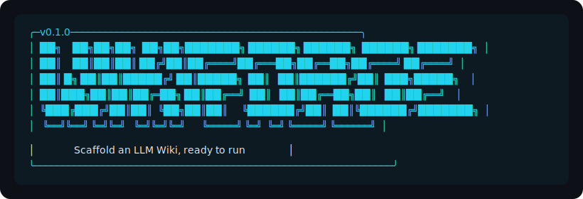

<p align="center">
  
</p>

<p align="center">
  <strong>Scaffold an LLM Wiki — a compounding, agent-maintained knowledge base.</strong><br>
  <sub>Karpathy's LLM Wiki pattern + BMAD-style agents and workflows, generated in 60 seconds.</sub>
</p>

<p align="center">
  <a href="https://github.com/rileydrakedesign/wikiforge/actions/workflows/test.yml"></a>
  
  
  
  
</p>

<p align="center">
  <a href="#what-you-get">What you get</a> ·
  <a href="#why-an-llm-wiki">Why an LLM Wiki</a> ·
  <a href="#the-three-core-loops">Core Loops</a> ·
  <a href="#agents">Agents</a> ·
  <a href="#skills">Skills</a> ·
  <a href="#supervision-modes">Modes</a> ·
  <a href="#how-the-wiki-stays-maintained">Maintenance</a> ·
  <a href="#use-with-obsidian">Obsidian</a>
</p>

---

## What you get

```bash
npx wikiforge init
```

60 seconds later:

```
my-wiki/
├── CLAUDE.md                   # Schema — how the LLM operates on the wiki
├── wikiforge.yaml              # Boot config (re-run wforge anytime)
├── .forge/
│   ├── agents/                 # 8 agent personas with capability menus
│   ├── skills/                 # 22 workflows across the wiki lifecycle
│   ├── core/                   # /wforge-help navigation skill
│   └── tools/                  # CLI helpers (search, graph, watch, diff)
├── wiki/                       # LLM-maintained: index, log, entities, concepts, sources, comparisons, overview
├── raw/                        # Your source documents (immutable)
├── outputs/                    # Render targets — slides, reports, exports
└── .obsidian/                  # (optional) pre-configured vault — graph view, attachment folder
```

Open in your LLM tool (`claude`, `cursor`, `codex`). Start with:

> *"Ingest this source: https://..."*

Iris reads it, files entity/concept pages, updates the index and overview, appends to the log, and cross-references against everything already in the wiki. One source typically touches 10–15 pages. Your knowledge compounds.

---

## Why an LLM Wiki?

**Not RAG.** Sources are never chunked for retrieval. The LLM **reads each source once** and integrates the knowledge into a persistent, structured wiki — entity pages, concept pages, summaries, comparisons. Cross-references are pre-built. Contradictions are flagged. The synthesis already reflects everything you've ingested.

You curate sources and ask the questions. The LLM does all the bookkeeping — the part humans give up on when wikis decay.

| | RAG | LLM Wiki |
|---|---|---|
| Knowledge at query time | Re-derived per query | Already compiled |
| Cross-references | None (fragments) | Pre-built and bidirectional |
| Contradictions | Silently averaged | Flagged with `confidence: disputed` |
| Synthesis | Per query | Compounds in the wiki |
| Maintenance | None needed (nothing kept) | Automated by the LLM |
| Browse | None — only ask | Open the directory; follow `[[wikilinks]]` |

### Three layers

| Layer | Directory | Owner | Mutable? |
|---|---|---|---|
| **Raw** | `raw/` | You | Immutable — primary sources |
| **Wiki** | `wiki/` | LLM | Yes — the LLM owns this entirely |
| **Schema** | `CLAUDE.md` / `AGENTS.md` / `.cursorrules` | Both | Co-evolves over time |

Pattern via [Karpathy's LLM Wiki gist](https://gist.github.com/karpathy/442a6bf555914893e9891c11519de94f). WikiForge takes that abstract pattern and generates a concrete, ready-to-run implementation tailored to your domain.

---

## The three Core Loops

These are what make a WikiForge repo a *compounding* wiki rather than a notes folder. The agents enforce them; you should rarely notice them happening:

1. **🧭 Index-first navigation** — agents read `wiki/index.md` before searching individual pages. The catalog narrows the candidate set; drill-in comes after.
2. **♻️ Answers compound back into the wiki** — novel synthesis from queries gets filed back as new pages via the `file-answer` skill (comparisons → `wiki/comparisons/`, analyses → `wiki/concepts/`). Good answers don't evaporate into chat history.
3. **📜 Operations log in parseable form** — every ingest, query, lint, and maintenance action appends to `wiki/log.md` with `## [ISO-timestamp] operation | title`. The regular prefix makes the log greppable: `grep "^## \[" wiki/log.md | tail -10`.

---

## Agents

WikiForge generates eight specialized agent personas. **Agents are personas, not separate runtimes** — one LLM session adopts whichever role you invoke. Switching agents is switching modes, not handing off between processes.

| Agent | Role | Owns |
|---|---|---|
| 📖 **Iris** | Ingestion | Reads sources, extracts knowledge, updates entity/concept/source pages, refreshes the overview |
| ❓ **Quinn** | Query | Answers questions with citations; files novel synthesis back into the wiki |
| 🔧 **Linus** | Lint | Health-checks the wiki, auto-fixes the safe categories, owns schema revision |
| 🕵️ **Rex** | Research | Finds new sources via web search to fill identified gaps |
| ⚔️ **Diana** | Debate | Adversarial review of disputed claims |
| 📝 **Sophie** | Synthesis | Renders deliverables (reports, slides, digests) as views of the wiki |
| 📚 **Leo** | Librarian | Index, taxonomy, cross-references, supersession, deduplication |
| 📊 **Axel** | Analysis | Comparisons, charts, structured analyses |

Only Iris, Quinn, and Linus are enabled by default. Add more during setup.

---

## Skills

Twenty-two workflows organized across the wiki lifecycle:

| Phase | Skills | Purpose |
|---|---|---|
| **1. Acquisition** | `ingest-source` · `batch-ingest` · `web-research` | Bring sources into `raw/`; convert and process |
| **2. Compilation** | `update-entities` · `update-concepts` · `cross-reference` · `update-overview` · `file-answer` | Build wiki pages from sources and from answers worth keeping |
| **3. Analysis** | `query-wiki` · `generate-comparison` · `adversarial-review` | Extract insights; challenge claims |
| **4. Synthesis** | `compile-output` · `generate-slides` · `export-report` · `periodic-digest` | Render deliverables and recurring summaries from wiki content |
| **Maintenance** | `lint-wiki` · `reindex` · `stats` · `resolve-contradiction` · `supersede-claim` · `deduplicate` · `decay-and-verify` · `revise-schema` | Keep the wiki healthy, current, internally consistent — and let the schema co-evolve |

Each skill ships as an IDE launcher (e.g. `/wforge-ingest-source` in Claude Code) and a documented workflow under `.forge/skills/{phase}/`. Workflows are conditional — skills only get installed when their underlying agent is enabled.

---

## Supervision modes

Set a default via the questionnaire; override per-invocation with `--mode`.

| Mode | Behavior |
|---|---|
| `deliberate` | Every operation stops for your approval. You curate sources and guide emphasis; the LLM does the bookkeeping. |
| `batch` | Operations process in batches with brief summaries — review the cumulative result after. |
| `autonomous` | Agents chain automatically: **Rex → Iris → Leo → Linus → cycle report**. Queries auto-save novel synthesis. Contradictions auto-flag. All decisions logged with `[AUTO]` prefix. One cycle, no loops. |

Any workflow accepts `--mode deliberate|batch|autonomous` at invocation, overriding the config default. Supervision is a per-conversation choice, not a global setting.

### Maturity thresholds (autonomous bootstrap)

Autonomous mode is *not* fully autonomous from day one — sparse wikis can't guide their own research. Tunable in `.forge/config.yaml`:

| Setting | Default | Gates |
|---|---|---|
| `maturity.research_sources_min` | 3 | Rex's autonomous gap identification |
| `maturity.review_pages_min` | 5 | Diana's autonomous claim review |
| `maturity.synthesis_pages_min` | 3 | Quinn's auto-filing of query synthesis |

Below these, agents fall back to human-guided behavior. As the wiki grows, the system becomes progressively more autonomous.

---

## How the wiki stays maintained

The hard part of any wiki is maintenance. WikiForge bakes it in:

- **Lifecycle frontmatter** on every page — `status`, `supersedes`, `superseded_by`, `last_verified` drive the maintenance workflows. Not optional metadata; part of the page contract.
- **Auto-fixing lint** — Linus repairs the mechanical issues (broken cross-refs to renamed pages, missing index entries, stub creation, frontmatter normalization) and reports the rest. Run with `--report-only` to see findings without fixing.
- **Decay & verify** — pages with `last_verified` past `decay_threshold_days` (180/90/60 by wiki scale) become candidates for re-verification against current sources.
- **Raw immutability** — every lint pass re-hashes `raw/` files and reports `content_hash` mismatches under "Modified Sources". Never auto-fixed; re-ingestion is the only safe path.
- **Contradictions** flagged with `confidence: disputed`, never silently resolved. The `resolve-contradiction` skill annotates, splits, supersedes, or reconciles.
- **Deduplication** via `content_hash` matching and title/alias similarity. Duplicates are merged, not deleted — non-canonical pages become historical record.
- **Schema co-evolution** — `wforge-revise-schema` scans the log for friction signals (ad-hoc page types, frontmatter drift, principles routinely bent) and proposes a schema diff for your approval. The schema is the contract you and the LLM revise together as you learn what the domain needs.

---

## Use with Obsidian

> *"Obsidian is the IDE; the LLM is the programmer; the wiki is the codebase."* — the LLM Wiki gist

When you pick **Obsidian-optimized** in outputs, WikiForge scaffolds an opt-in `.obsidian/` vault:

- `app.json` with wikilink format + `attachmentFolderPath: raw/assets/` per the gist
- `graph.json` color-coded by wiki subdirectory (entities, concepts, sources, comparisons)
- Sensible core plugins enabled (graph, backlinks, outgoing-link, tag-pane, page-preview, outline)
- README walkthrough for binding `Cmd/Ctrl + Shift + D` to "Download attachments for current file"

Open the wiki on one side, the LLM agent on the other. As the agent edits pages, watch them update live; browse via `[[wikilinks]]` and the graph view. Add Dataview from community plugins to run live tables over frontmatter — e.g. *"all entities with `confidence: disputed`, sorted by `source_count`"*.

---

## Supported LLM tools

WikiForge generates the appropriate schema file and launcher stubs for your tool:

| Tool | Schema file | Launcher dir |
|---|---|---|
| Claude Code | `CLAUDE.md` | `.claude/skills/` |
| Cursor | `.cursorrules` | `.cursor/skills/` |
| Codex / generic | `AGENTS.md` | `.codex/skills/` |

---

## Setup

```bash
wforge init                                       # Full guided questionnaire (recommended)
wforge init --quick                               # Minimal questions, sensible defaults
wforge init --config path/to/wikiforge.yaml       # Regenerate from saved config
wforge init --preset autonomous-wiki              # Start from a community template
wforge init --no-git                              # Skip initial git commit
```

### Community presets

| Preset | Best for |
|---|---|
| `academic-research` | Papers, citations, thesis-driven organization, academic citation format |
| `autonomous-wiki` | Hands-off ingestion — agents chain automatically from research through lint |
| `book-companion` | Chapter-by-chapter chronological reading companion |
| `competitive-analysis` | Entity-first companies, products, market intelligence |
| `personal-knowledge` | General-purpose wiki, Obsidian-optimized |

---

## Lineage

The LLM Wiki pattern descends in spirit from Vannevar Bush's [Memex](https://en.wikipedia.org/wiki/Memex) (1945) — a personal, curated knowledge store with associative trails between documents. Bush's vision was closer to this than to what the public web became: private, actively curated, with the connections between documents as valuable as the documents themselves. The part Bush couldn't solve was who does the maintenance. The LLM handles that now.

For a sense of scale, look at [Tolkien Gateway](https://tolkiengateway.net/wiki/Main_Page) — thousands of interlinked pages built and maintained by volunteers over years. WikiForge generates the scaffold to build something with that shape, personally, with one human curating and one LLM doing the cross-references.

---

## Development

```bash
git clone https://github.com/rileydrakedesign/wikiforge.git
cd wikiforge
npm install
npm run build       # Compile TypeScript → dist/
npm run dev         # Watch mode
npm test            # Vitest suite
npm run lint        # Type-check, no emit
```

### Project structure

```
src/
  index.ts            # CLI entry (Commander + 14-step generation pipeline)
  cli/                # Questionnaire, quick-start, from-config flows
  generator/          # Per-domain generators (scaffold, schema, agents, skills, obsidian, …)
  config/             # WikiForgeConfig type + defaults + presets registry
  utils/              # fs, git, Handlebars rendering
templates/            # Handlebars .hbs templates — source of truth for generated content
presets/              # Community preset YAML files
tests/                # Vitest suite — smoke + helper coverage
```

CI runs lint + build + test on Node 18/20/22 for every push and PR.

---

## Project status

Pre-release alpha. The CLI is feature-complete and tested; not yet published to npm. Until then, install from source:

```bash
git clone https://github.com/rileydrakedesign/wikiforge.git
cd wikiforge && npm install && npm run build && npm link
# now `wforge` is on your PATH
```

## Requirements

Node.js ≥ 18

## License

[MIT](LICENSE) © Riley Drake
